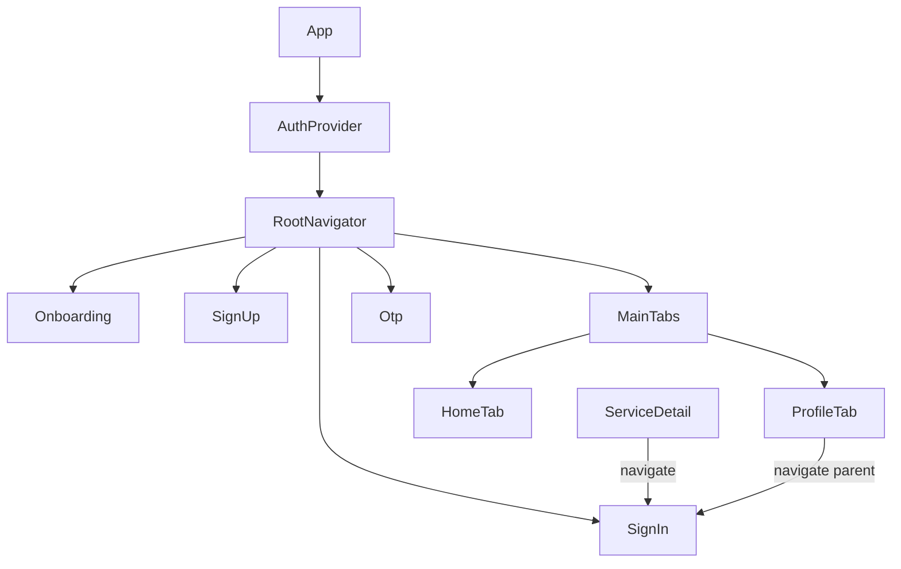

# Design Document: Auth & Navigation Flow

## Overview

This document describes the technical design for a set of authentication and navigation flow improvements to the LocalLoom React Native/Expo app. The changes span five areas:

1. **Onboarding completion path** — "Get Started" and "Skip" both navigate to `MainTabs` (not `SignUp`).
2. **Sign-up email field** — Add an email input between Name and Phone, with validation.
3. **Sign-in credential input** — Replace the phone-only field with a unified phone-or-email field.
4. **OTP subtitle** — Dynamically show which credential (phone or email) the code was sent to.
5. **Validation utilities** — Add `validateEmail` and `sanitizeEmail` to the shared `Validator` module.

Requirements 2 (ServiceDetail login overlay) and 3 (Profile sign-in button) are already implemented correctly and require no code changes; they are documented here for completeness.

---

## Architecture

The app uses React Navigation v7 with a single `RootNavigator` (native stack) and a nested `MainTabs` bottom-tab navigator. Authentication state is managed by `AuthContext` (backed by `AsyncStorage`). All screen-to-screen transitions are driven by callback props passed down from `RootNavigator` into screen components, keeping screens navigation-agnostic.



The changes in this feature stay within this existing architecture. No new navigators or context providers are introduced.

---

## Components and Interfaces

### 1. `RootNavigator` — Onboarding screen handler

**Current behaviour:** `onComplete` navigates to `SignUp`.  
**New behaviour:** `onComplete` navigates to `MainTabs`.

```tsx
// Before
<OnboardingFlow
  onComplete={() => navigation.navigate('SignUp')}
  onSkip={() => navigation.navigate('MainTabs')}
/>

// After
<OnboardingFlow
  onComplete={() => navigation.navigate('MainTabs')}
  onSkip={() => navigation.navigate('MainTabs')}
/>
```

No changes to `OnboardingFlow`, `OnboardingConnect`, or `OnboardingWelcome` are required.

---

### 2. `SignUpScreen` — Email field addition

A new email `AppTextField` is inserted between the Name field and the Phone field. The `onContinue` callback type is extended to include `email`.

**Updated `Props` type:**
```ts
type Props = {
  onContinue: (data: { role: Role; fullName: string; email: string; phone: string }) => void;
  onBack: () => void;
  onSignIn: () => void;
  onSkipToHome: () => void;
};
```

**`canSubmit` logic** — all four fields must pass validation:
```ts
const canSubmit = useMemo(() => {
  if (!role) return false;
  if (!fullName.trim() || !email.trim() || !mobile.trim()) return false;
  if (validateName(fullName) || validateEmail(email) || validatePhone(mobile)) return false;
  return true;
}, [role, fullName, email, mobile]);
```

**Field order in JSX:**
1. Name (`AppTextField`, `autoComplete="name"`)
2. Email (`AppTextField`, `autoComplete="email"`, `keyboardType="email-address"`)
3. Phone (`AppTextField`, `keyboardType="phone-pad"`)

Sanitisation on change uses `sanitizeEmail` (trim + lowercase). Validation error is shown inline below the field.

---

### 3. `SignInScreen` — Unified credential input

The existing phone-only `TextInput` is replaced with a single credential field that auto-detects type by the first character.

**Credential type detection (pure function, exported from `src/utils/validation.ts`):**
```ts
export type CredentialType = 'phone' | 'email' | 'empty';

export function detectCredentialType(value: string): CredentialType {
  if (!value) return 'empty';
  if (/^\d/.test(value)) return 'phone';
  return 'email';
}
```

**Updated `Props` type:**
```ts
type Props = {
  onBack: () => void;
  onSendOtp: (data: { phone?: string; email?: string }) => void;
};
```

**Validation logic in `SignInScreen`:**
```ts
function validateCredential(value: string): string | null {
  const type = detectCredentialType(value);
  if (type === 'empty') return 'Phone number or email is required.';
  if (type === 'phone') return validatePhone(value);
  return validateEmail(value);
}
```

**`onSendOtp` payload construction:**
```ts
const type = detectCredentialType(credential);
if (type === 'phone') onSendOtp({ phone: credential, email: undefined });
else onSendOtp({ email: credential, phone: undefined });
```

**`keyboardType`** is set to `"email-address"` (supports both digits and letters on a single keyboard layout).

---

### 4. `OtpVerificationScreen` — Dynamic subtitle

**Updated `Props` type:**
```ts
type Props = {
  phone?: string;
  email?: string;
  onBack: () => void;
  onVerified: (data: { otp: string }) => void;
  onResend?: () => void;
};
```

**Subtitle derivation:**
```ts
const destination = phone ?? email ?? 'your contact';
// Renders: "OTP has been sent to {destination}."
```

**`RootStackParamList` update:**
```ts
Otp: { phone?: string; email?: string };
```

**`OtpScreen` in `RootNavigator`** reads both params and forwards them:
```tsx
<OtpVerificationScreen
  phone={route.params.phone}
  email={route.params.email}
  onBack={() => navigation.goBack()}
  onVerified={async () => {
    await login();
    navigation.replace('MainTabs');
  }}
/>
```

**`SignUpScreen`** navigates to `Otp` with both credential fields available:
```ts
onContinue={({ phone, email }) => navigation.navigate('Otp', { phone, email })}
```

**`SignInScreen`** navigates to `Otp` with whichever credential was used:
```ts
onSendOtp={({ phone, email }) => navigation.navigate('Otp', { phone, email })}
```

---

### 5. Validation utilities (`src/utils/validation.ts`)

Two new exports are added to the existing module:

```ts
const EMAIL_REGEX = /^[^\s@]+@[^\s@]+\.[^\s@]+$/;

export function validateEmail(value: string): string | null {
  if (!value) return 'Email is required.';
  if (!EMAIL_REGEX.test(value)) return 'Enter a valid email address.';
  return null;
}

export function sanitizeEmail(input: string): { value: string; hadInvalid: boolean } {
  const trimmed = input.trim();
  const lowered = trimmed.toLowerCase();
  const hadInvalid = trimmed !== input; // leading/trailing whitespace was present
  return { value: lowered, hadInvalid };
}
```

`detectCredentialType` (described in §3 above) is also added here so it can be shared between `SignInScreen` and any future consumers.

---

## Data Models

### `RootStackParamList` (updated)

```ts
export type RootStackParamList = {
  Onboarding: undefined;
  SignUp: undefined;
  SignIn: undefined;
  Otp: { phone?: string; email?: string };   // was: { phone: string }
  MainTabs: undefined;
  // ... remaining routes unchanged
};
```

### `SignUpScreen` callback payload (updated)

```ts
type SignUpPayload = {
  role: 'tradie' | 'customer';
  fullName: string;
  email: string;       // new
  phone: string;
};
```

### `SignInScreen` callback payload (updated)

```ts
type SendOtpPayload = {
  phone?: string;
  email?: string;
};
```

### `OtpVerificationScreen` props (updated)

```ts
type OtpProps = {
  phone?: string;      // was: phone: string (required)
  email?: string;      // new
  onBack: () => void;
  onVerified: (data: { otp: string }) => void;
  onResend?: () => void;
};
```

---

## Correctness Properties

*A property is a characteristic or behavior that should hold true across all valid executions of a system — essentially, a formal statement about what the system should do. Properties serve as the bridge between human-readable specifications and machine-verifiable correctness guarantees.*

This feature includes pure validation logic (`validateEmail`, `sanitizeEmail`, `detectCredentialType`) that is well-suited to property-based testing. UI navigation and layout requirements are covered by example-based tests.

---

### Property 1: Invalid emails always produce an error

*For any* string that does not match `Email_Regex` (and is non-empty), `validateEmail` SHALL return a non-null error string.

**Validates: Requirements 4.3, 7.4**

---

### Property 2: Valid emails never produce an error

*For any* string that matches `Email_Regex`, `validateEmail` SHALL return `null`.

**Validates: Requirements 4.4, 7.5**

---

### Property 3: Email sanitize–validate round trip

*For any* valid email string `e`, `validateEmail(sanitizeEmail(e).value)` SHALL return `null` — sanitising a valid email must not make it invalid.

**Validates: Requirements 7.6**

---

### Property 4: Digit-leading inputs are detected as phone

*For any* non-empty string whose first character is a digit (0–9), `detectCredentialType` SHALL return `'phone'`.

**Validates: Requirements 5.2**

---

### Property 5: Letter-leading inputs are detected as email

*For any* non-empty string whose first character is a letter (a–z or A–Z), `detectCredentialType` SHALL return `'email'`.

**Validates: Requirements 5.3**

---

### Property 6: OTP subtitle always contains the credential

*For any* non-empty phone or email string passed to `OtpVerificationScreen`, the rendered subtitle text SHALL contain that exact string.

**Validates: Requirements 6.1, 6.2**

---

### Property 7: Sign-up Continue button disabled unless all fields valid

*For any* combination of `role`, `fullName`, `email`, and `phone` values where at least one field fails its validation rule, the "Continue" button SHALL be disabled.

**Validates: Requirements 4.6**

---

## Error Handling

| Scenario | Behaviour |
|---|---|
| `validateEmail('')` | Returns `"Email is required."` |
| `validateEmail('notanemail')` | Returns `"Enter a valid email address."` |
| `detectCredentialType('')` | Returns `'empty'`; `SignInScreen` shows `"Phone number or email is required."` |
| `OtpVerificationScreen` receives neither `phone` nor `email` | Subtitle falls back to `"OTP has been sent to your contact."` |
| Sign-up form submitted with any invalid field | Inline error shown below the offending field; form not submitted |
| Sign-in form submitted with invalid credential | Inline error shown; `onSendOtp` not called |

All validation errors are surfaced inline (below the relevant field) using the existing `AppTextField` `error` prop pattern already used throughout the app.

---

## Testing Strategy

### Unit / Example-based tests

These cover specific interactions, UI structure, and error messages:

- `RootNavigator` Onboarding handler calls `navigate('MainTabs')` (not `navigate('SignUp')`) when `onComplete` fires.
- `SignUpScreen` renders email field between name and phone fields.
- `SignUpScreen` calls `onContinue` with `{ role, fullName, email, phone }` on valid submission.
- `SignInScreen` renders a single credential field with `keyboardType="email-address"`.
- `SignInScreen` calls `onSendOtp({ phone, email: undefined })` for a digit-leading input.
- `SignInScreen` calls `onSendOtp({ email, phone: undefined })` for a letter-leading input.
- `OtpVerificationScreen` shows `"OTP has been sent to your contact."` when both `phone` and `email` are undefined.
- `validateEmail('')` returns `"Email is required."`.
- `validateEmail` with a non-matching string returns `"Enter a valid email address."`.
- `detectCredentialType('')` returns `'empty'`.

### Property-based tests

Use a property-based testing library (e.g., [fast-check](https://github.com/dubzzz/fast-check)) to verify the seven correctness properties above. Each test runs a minimum of 100 iterations.

Tag format: `Feature: auth-navigation-flow, Property {N}: {property_text}`

**Property 1** — Generate arbitrary non-empty strings that fail `Email_Regex`; assert `validateEmail` returns a non-null string.  
**Property 2** — Generate strings matching `Email_Regex` (e.g., `fc.emailAddress()`); assert `validateEmail` returns `null`.  
**Property 3** — Generate valid email strings; apply `sanitizeEmail` then `validateEmail`; assert result is `null`.  
**Property 4** — Generate strings with `fc.stringMatching(/^\d.*/)`; assert `detectCredentialType` returns `'phone'`.  
**Property 5** — Generate strings with `fc.stringMatching(/^[a-zA-Z].*/)`; assert `detectCredentialType` returns `'email'`.  
**Property 6** — Generate arbitrary non-empty strings as `phone` or `email` prop; render `OtpVerificationScreen`; assert subtitle text contains the generated string.  
**Property 7** — Generate combinations of field values with at least one invalid; assert `canSubmit` logic returns `false`.

### Integration / smoke tests

- TypeScript compilation confirms `RootStackParamList.Otp` accepts `{ phone?: string; email?: string }`.
- TypeScript compilation confirms `validateEmail` and `sanitizeEmail` are exported from `src/utils/validation.ts` with the correct signatures.
